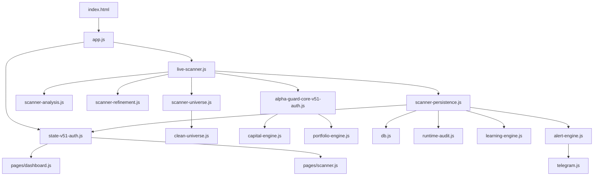
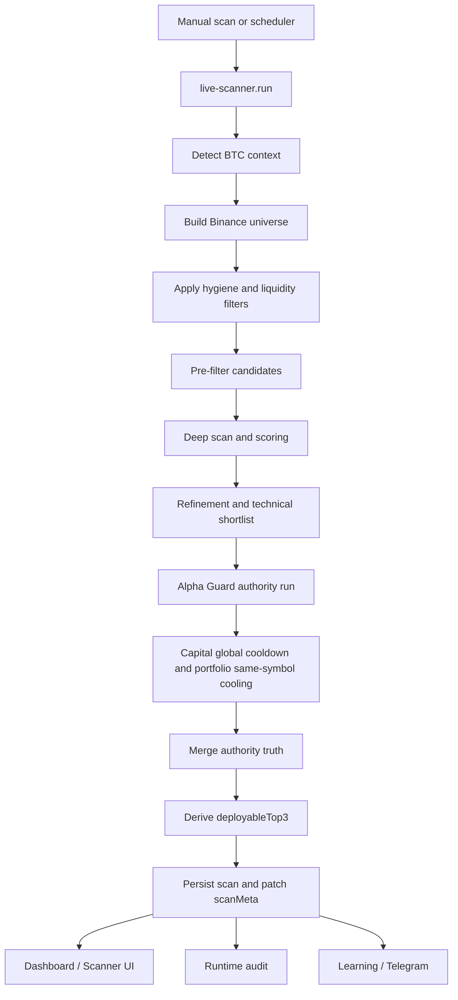
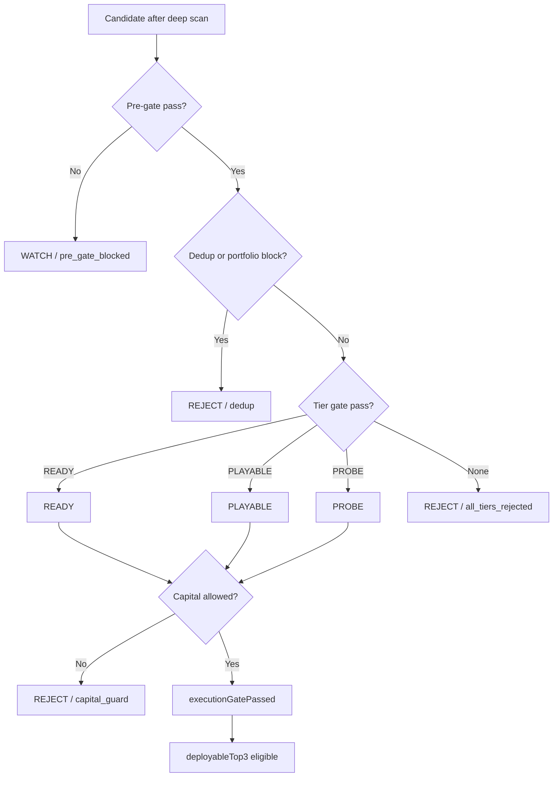
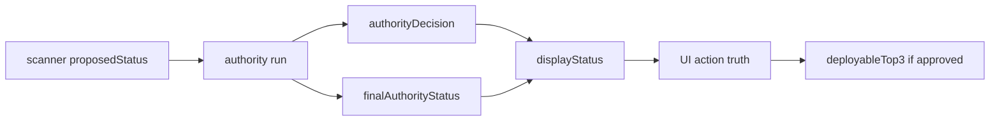

# SystemTrader System Map

Quick visual map of the current runtime. Use this when the code feels too large to hold in memory.

This is a quick architecture map, not the final specification. If there is a conflict, trust current code first, then `ARCHITECTURE.md`.

## Architecture Map

## Runtime Flow

## Decision Brain

## Truth Map

## Quick Debug Checklist

For one coin:

1. Read `displayStatus`.
2. Read `finalAuthorityStatus`.
3. Read `authorityDecision`.
4. Read `authorityReason`.
5. Inspect `authorityTrace.rejectionsByTier`.
6. Check `executionGatePassed` and `executionActionable`.
7. Check whether it appears in `deployableTop3`.
8. Distinguish `cooldown_active_*` from capital cadence and `cooling_period_active_*` from same-symbol portfolio cooling.

For a whole scan:

1. Run `RUNTIME_AUDIT.summarizeLatest()`.
2. Check `counts.total`, `counts.*_blocked`, and `filteredCandidates`.
3. Use `blockerRanking` to find the dominant choke point.
4. Compare `technicalTop3` with `deployableTop3`.
